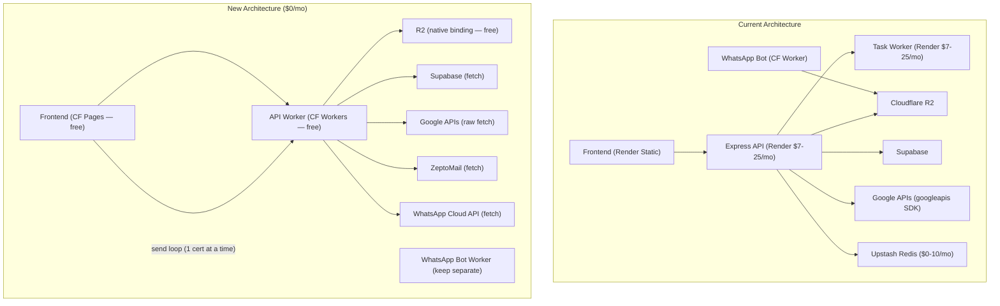

# Migrate Express API Server → Cloudflare Workers (Free Plan)

Replace the entire `apps/api-server` (Express + Node.js on Render) with a **Cloudflare Workers** API. Certificate sending uses a **client-side send loop** (same pattern as generation), eliminating the need for Cloudflare Queues and the paid plan entirely.

**Total infrastructure cost after migration: $0/month**

## User Review Required

> [!IMPORTANT]
> **This is a large migration** (~24 route files, ~4,600 lines of server code). Each phase can be deployed independently. The old server runs in parallel during migration.

> [!WARNING]
> **Google API SDK (`googleapis`) must be rewritten.** [googleDrive.ts](file:///c:/cephlow%20minimalist%20version/cephlow2/apps/api-server/src/lib/googleDrive.ts) (888 lines) and [googleSheets.ts](file:///c:/cephlow%20minimalist%20version/cephlow2/apps/api-server/src/lib/googleSheets.ts) use the `googleapis` Node.js SDK which depends on `http`, `stream`, `fs` — none of which exist in Workers. All Google API calls must be rewritten as raw `fetch()` calls.

> [!WARNING]
> **`cashfree-pg` SDK compatibility.** The Cashfree SDK may use Node.js-specific APIs. Will rewrite to raw REST API calls. Same for `qrcode` (uses Canvas/Buffer).

## Open Questions

> [!IMPORTANT]
> 1. **Keep the existing WhatsApp bot worker separate or merge?** You already have a [whatsapp-cert-bot](file:///c:/cephlow%20minimalist%20version/cephlow2/cloudflare-worker/wrangler.toml) Worker. Merge into the new API Worker or keep separate?
> 2. **Frontend hosting?** Currently on Render static. Move to Cloudflare Pages (free)? Unified dashboard.
> 3. **Redis (Upstash)** — no longer needed for task queue. Is it used for anything else? If not, drop it entirely.

## Architecture Overview



### Key Architecture Change: Client-Side Send Loop

Currently, batch sending works as:
```
User clicks "Send All" → Server queues 1 task → Polling worker processes all certs in a loop
```

New approach (mirrors existing generation pattern):
```
User clicks "Send All" → Frontend loops through certs one-by-one:
  → POST /api/certificates/:certId/send-email   (cert 1) → ✅
  → POST /api/certificates/:certId/send-email   (cert 2) → ✅
  → POST /api/certificates/:certId/send-email   (cert 3) → ❌ retry
  → ...progress bar updates in real-time
```

Each request processes **1 send** → ~1-2ms CPU (rest is I/O) → fits within **10ms free-plan CPU limit**.

**What this eliminates:**
- ❌ Cloudflare Queues (paid plan only)
- ❌ [worker.ts](file:///c:/cephlow%20minimalist%20version/cephlow2/apps/api-server/src/worker.ts) (polling loop)
- ❌ [sendEmail.ts processor](file:///c:/cephlow%20minimalist%20version/cephlow2/apps/api-server/src/processors/sendEmail.ts) (batch processor)
- ❌ [sendWhatsApp.ts processor](file:///c:/cephlow%20minimalist%20version/cephlow2/apps/api-server/src/processors/sendWhatsApp.ts) (batch processor)
- ❌ Supabase `tasks` table (no longer needed for dispatch)
- ❌ Redis/Upstash (no longer needed)

---

## Proposed Changes

### Phase 1: Project Scaffolding (~2 hours)

#### [NEW] `workers/api/wrangler.toml`
```toml
name = "cephlow-api"
main = "src/index.ts"
compatibility_date = "2024-12-01"
compatibility_flags = ["nodejs_compat"]

[[r2_buckets]]
binding = "CERTIFICATES"
bucket_name = "certificates"

[[kv_namespaces]]
binding = "CACHE"
id = "<created-via-wrangler>"

[vars]
R2_PUBLIC_URL = "https://pub-3e00f49622064202a04c19fb33ee2976.r2.dev"
PUBLIC_BASE_URL = "https://cephlow.online"
FRONTEND_URL = "https://cephlow.online"
```

No Queue bindings. No paid-plan features.

#### [NEW] `workers/api/src/index.ts`
Worker entry point using **Hono** (lightweight Workers-native router):
```typescript
import { Hono } from 'hono'
import { cors } from 'hono/cors'

const app = new Hono<{ Bindings: Env }>()
app.use('*', cors({ origin: true, ... }))

// Public routes (no auth)
app.route('/api', healthRoutes)
app.route('/api', verifyRoutes)
app.route('/api', galleryRoutes)
app.route('/api', profilesRoutes)
app.route('/api', authRoutes)
app.route('/api', webhooksRoutes)
app.route('/api', qrRoutes)
app.route('/api', internalRoutes)

// Authenticated routes
app.use('/api/*', authMiddleware)
app.route('/api', approvalRoutes)
app.route('/api', workspacesRoutes)
app.route('/api', creatorCreditsRoutes)

// Workspace-scoped routes
app.use('/api/*', workspaceMiddleware)
app.route('/api', batchesRoutes)
app.route('/api', certificatesRoutes)
// ... etc

export default app
```

#### [NEW] `workers/api/src/middleware/auth.ts`
Port of [auth.ts](file:///c:/cephlow%20minimalist%20version/cephlow2/apps/api-server/src/middlewares/auth.ts). Verify Supabase JWT using Web Crypto API (no `jsonwebtoken` needed):
```typescript
const key = await crypto.subtle.importKey('raw', secret, { name: 'HMAC', hash: 'SHA-256' }, false, ['verify'])
const valid = await crypto.subtle.verify('HMAC', key, signature, payload)
```

#### [NEW] `workers/api/src/middleware/workspace.ts`
Port of [requireWorkspace.ts](file:///c:/cephlow%20minimalist%20version/cephlow2/apps/api-server/src/middlewares/requireWorkspace.ts).

#### [NEW] `workers/api/src/middleware/approval.ts`
Port of [requireApproval.ts](file:///c:/cephlow%20minimalist%20version/cephlow2/apps/api-server/src/middlewares/requireApproval.ts).

---

### Phase 2: Library Rewrites (~8-12 hours)

#### [NEW] `workers/api/src/lib/supabase.ts`
Supabase client using `@supabase/supabase-js` (Works in Workers since it uses `fetch`).

#### [NEW] `workers/api/src/lib/google-auth.ts`
Port of [googleAuth.ts](file:///c:/cephlow%20minimalist%20version/cephlow2/apps/api-server/src/lib/googleAuth.ts). Rewrite OAuth2 flow using raw `fetch()`:
- `generateAuthUrl()` → construct URL string manually
- `handleCallback()` → `fetch('https://oauth2.googleapis.com/token', ...)` 
- `getAccessToken()` → `fetch('https://oauth2.googleapis.com/token', { grant_type: 'refresh_token', ... })`
- `disconnectGoogleToken()` → `fetch('https://oauth2.googleapis.com/revoke', ...)`

#### [NEW] `workers/api/src/lib/google-drive.ts`
Port of [googleDrive.ts](file:///c:/cephlow%20minimalist%20version/cephlow2/apps/api-server/src/lib/googleDrive.ts) (888 lines → ~400 lines). Replace `googleapis` SDK with raw REST:

| SDK Call | REST Replacement |
|---|---|
| `drive.files.list()` | `GET https://www.googleapis.com/drive/v3/files?q=...` |
| `drive.files.copy()` | `POST https://www.googleapis.com/drive/v3/files/{id}/copy` |
| `drive.files.create()` | `POST https://www.googleapis.com/upload/drive/v3/files` |
| `drive.files.delete()` | `DELETE https://www.googleapis.com/drive/v3/files/{id}` |
| `drive.files.export()` | `GET https://www.googleapis.com/drive/v3/files/{id}/export` |
| `drive.permissions.create()` | `POST https://www.googleapis.com/drive/v3/files/{id}/permissions` |
| `slides.presentations.get()` | `GET https://slides.googleapis.com/v1/presentations/{id}` |
| `slides.presentations.batchUpdate()` | `POST https://slides.googleapis.com/v1/presentations/{id}:batchUpdate` |

All calls use `Authorization: Bearer {accessToken}` header.

#### [NEW] `workers/api/src/lib/google-sheets.ts`
Port of [googleSheets.ts](file:///c:/cephlow%20minimalist%20version/cephlow2/apps/api-server/src/lib/googleSheets.ts). Replace:

| SDK Call | REST Replacement |
|---|---|
| `sheets.spreadsheets.values.get()` | `GET https://sheets.googleapis.com/v4/spreadsheets/{id}/values/{range}` |
| `sheets.spreadsheets.create()` | `POST https://sheets.googleapis.com/v4/spreadsheets` |

#### [NEW] `workers/api/src/lib/r2.ts`
Port of [cloudflareR2.ts](file:///c:/cephlow%20minimalist%20version/cephlow2/apps/api-server/src/lib/cloudflareR2.ts) (231 lines → ~50 lines). Replace S3 SDK with **native R2 binding**:

```typescript
// Before (S3 SDK):
const client = new S3Client({ ... })
await client.send(new PutObjectCommand({ Bucket, Key, Body, ContentType }))

// After (R2 binding):
await env.CERTIFICATES.put(key, buffer, { httpMetadata: { contentType } })
```

> [!NOTE]
> Presigned URLs still need the S3-compatible API. We keep `@aws-sdk/client-s3` + `@aws-sdk/s3-request-presigner` for `generatePresignedPutUrl()` only — these work in Workers.

#### [NEW] `workers/api/src/lib/email.ts`
Port of [gmail.ts](file:///c:/cephlow%20minimalist%20version/cephlow2/apps/api-server/src/lib/gmail.ts). Already uses `fetch()` to call ZeptoMail — near-direct copy, swap `Buffer.from()` with `btoa()`.

#### [NEW] `workers/api/src/lib/whatsapp.ts`
Port of [whatsapp.ts](file:///c:/cephlow%20minimalist%20version/cephlow2/apps/api-server/src/lib/whatsapp.ts). Already pure `fetch()` — direct copy.

#### [NEW] `workers/api/src/lib/qr.ts`
QR code generation. Use `qrcode` with `toDataURL()` / `toString('svg')` (no Canvas needed in Workers), or a WASM-based QR library.

#### [NEW] `workers/api/src/lib/cashfree.ts`
Rewrite `cashfree-pg` SDK as raw REST:
- `PGCreateOrder` → `POST https://api.cashfree.com/pg/orders`
- `PGFetchOrder` → `GET https://api.cashfree.com/pg/orders/{order_id}`
- `PGVerifyWebhookSignature` → HMAC verification via Web Crypto API

---

### Phase 3: Route Migration (~8-10 hours)

Port all route files. Business logic stays identical — only Express → Hono conversion.

#### Express → Hono pattern:
```typescript
// Before (Express):
router.get("/batches", async (req, res) => {
  const userId = req.user?.uid;
  return res.json({ batches });
});

// After (Hono):
app.get("/api/batches", async (c) => {
  const userId = c.get("user").uid;
  return c.json({ batches });
});
```

#### Route files to port (in dependency order):

| # | Route File | Lines | Complexity | Notes |
|---|---|---|---|---|
| 1 | [health.ts](file:///c:/cephlow%20minimalist%20version/cephlow2/apps/api-server/src/routes/health.ts) | 6 | Trivial | Health check |
| 2 | [auth.ts](file:///c:/cephlow%20minimalist%20version/cephlow2/apps/api-server/src/routes/auth.ts) | 86 | Low | Google OAuth — uses rewritten `google-auth.ts` |
| 3 | [approval.ts](file:///c:/cephlow%20minimalist%20version/cephlow2/apps/api-server/src/routes/approval.ts) | ~30 | Trivial | Reads `user_profiles` |
| 4 | [workspaces.ts](file:///c:/cephlow%20minimalist%20version/cephlow2/apps/api-server/src/routes/workspaces.ts) | 328 | Medium | CRUD + invites |
| 5 | [verify.ts](file:///c:/cephlow%20minimalist%20version/cephlow2/apps/api-server/src/routes/verify.ts) | 90 | Low | Public cert verification + QR |
| 6 | [gallery.ts](file:///c:/cephlow%20minimalist%20version/cephlow2/apps/api-server/src/routes/gallery.ts) | ~60 | Low | Public gallery |
| 7 | [profiles.ts](file:///c:/cephlow%20minimalist%20version/cephlow2/apps/api-server/src/routes/profiles.ts) | ~180 | Low | Student profiles |
| 8 | [qr.ts](file:///c:/cephlow%20minimalist%20version/cephlow2/apps/api-server/src/routes/qr.ts) | ~25 | Low | QR image |
| 9 | [sheets.ts](file:///c:/cephlow%20minimalist%20version/cephlow2/apps/api-server/src/routes/sheets.ts) | ~80 | Medium | Google Sheets |
| 10 | [slides.ts](file:///c:/cephlow%20minimalist%20version/cephlow2/apps/api-server/src/routes/slides.ts) | ~90 | Medium | Google Slides |
| 11 | [spreadsheets.ts](file:///c:/cephlow%20minimalist%20version/cephlow2/apps/api-server/src/routes/spreadsheets.ts) | ~160 | Medium | Inbuilt spreadsheets |
| 12 | [batches.ts](file:///c:/cephlow%20minimalist%20version/cephlow2/apps/api-server/src/routes/batches.ts) | 1088 | **High** | Batch CRUD + send (modified) |
| 13 | [certificates.ts](file:///c:/cephlow%20minimalist%20version/cephlow2/apps/api-server/src/routes/certificates.ts) | ~230 | Medium | Certificate ops |
| 14 | [clientGenerate.ts](file:///c:/cephlow%20minimalist%20version/cephlow2/apps/api-server/src/routes/clientGenerate.ts) | 546 | **High** | Generation orchestration |
| 15 | [payments.ts](file:///c:/cephlow%20minimalist%20version/cephlow2/apps/api-server/src/routes/payments.ts) | 147 | Medium | Cashfree |
| 16 | [webhooks.ts](file:///c:/cephlow%20minimalist%20version/cephlow2/apps/api-server/src/routes/webhooks.ts) | 137 | Medium | WhatsApp + Cashfree webhooks |
| 17 | [wallet.ts](file:///c:/cephlow%20minimalist%20version/cephlow2/apps/api-server/src/routes/wallet.ts) | ~200 | Medium | Wallet/ledger |
| 18 | [reports.ts](file:///c:/cephlow%20minimalist%20version/cephlow2/apps/api-server/src/routes/reports.ts) | ~75 | Low | Reports |
| 19 | [builtinTemplates.ts](file:///c:/cephlow%20minimalist%20version/cephlow2/apps/api-server/src/routes/builtinTemplates.ts) | ~230 | Medium | Template CRUD |
| 20 | [frameTemplates.ts](file:///c:/cephlow%20minimalist%20version/cephlow2/apps/api-server/src/routes/frameTemplates.ts) | ~140 | Medium | Custom frames |
| 21 | [frameMarketplace.ts](file:///c:/cephlow%20minimalist%20version/cephlow2/apps/api-server/src/routes/frameMarketplace.ts) | ~460 | Medium | Marketplace |
| 22 | [creatorCredits.ts](file:///c:/cephlow%20minimalist%20version/cephlow2/apps/api-server/src/routes/creatorCredits.ts) | ~460 | Medium | Creator credits |
| 23 | [internal.ts](file:///c:/cephlow%20minimalist%20version/cephlow2/apps/api-server/src/routes/internal.ts) | 119 | Low | Worker→API notifications |

---

### Phase 4: Send Endpoint Refactoring (~3 hours)

The batch send endpoints change from "queue a task" to "send 1 cert per request." The per-cert endpoints already exist — they just need refinement.

#### [MODIFY] Batch send endpoints in `workers/api/src/routes/batches.ts`

**Remove** the batch-level send endpoints that queue tasks:
- ~~`POST /batches/:batchId/send`~~ → removed (was: insert into `tasks` table)
- ~~`POST /batches/:batchId/send-whatsapp`~~ → removed (was: insert into `tasks` table)

**Keep and refine** the per-cert endpoints:
- `POST /batches/:batchId/certificates/:certId/send` → sends 1 email (already exists)
- `POST /batches/:batchId/certificates/:certId/send-whatsapp` → sends 1 WhatsApp (already exists)

**Add** new status-tracking endpoints:
- `POST /batches/:batchId/send-start` → sets batch status to "sending"
- `POST /batches/:batchId/send-complete` → sets batch status based on results (like `client-complete` for generation)

#### Per-cert email send logic (inline, no processor needed):
```typescript
app.post('/api/batches/:batchId/certificates/:certId/send-email', async (c) => {
  // 1. Verify access
  // 2. Get cert + batch from Supabase
  // 3. Fetch PDF from R2 (if r2PdfUrl) or Drive
  // 4. Base64 encode PDF
  // 5. Apply personalization to subject/body
  // 6. Call ZeptoMail API
  // 7. Update cert status → "sent"
  // 8. Return { success: true }
  // Total CPU: ~1-2ms | Total wall time: ~500ms-2s (network I/O)
})
```

#### [DELETE] Files no longer needed:
- `apps/api-server/src/worker.ts` — polling worker
- `apps/api-server/src/processors/sendEmail.ts` — batch email processor
- `apps/api-server/src/processors/sendWhatsApp.ts` — batch WhatsApp processor

---

### Phase 5: Frontend — Client-Side Send Loop (~4 hours)

Add a send loop to the frontend that mirrors the existing generation loop.

#### [NEW] `apps/cert-app/src/hooks/use-client-send.ts`

New hook modeled after the existing client-generate flow:

```typescript
export function useClientSend() {
  const [progress, setProgress] = useState({ sent: 0, failed: 0, total: 0 })
  const [isSending, setIsSending] = useState(false)

  async function sendBatch(batchId: string, certIds: string[], mode: 'email' | 'whatsapp', opts) {
    setIsSending(true)
    setProgress({ sent: 0, failed: 0, total: certIds.length })

    // 1. Mark batch as "sending"
    await api.post(`/batches/${batchId}/send-start`)

    // 2. Loop through certs one-by-one (with concurrency of 2-3)
    const CONCURRENCY = 3
    for (let i = 0; i < certIds.length; i += CONCURRENCY) {
      const chunk = certIds.slice(i, i + CONCURRENCY)
      const results = await Promise.allSettled(
        chunk.map(certId =>
          api.post(`/batches/${batchId}/certificates/${certId}/send-${mode}`, opts)
        )
      )

      // 3. Update progress
      for (const r of results) {
        if (r.status === 'fulfilled') setProgress(p => ({ ...p, sent: p.sent + 1 }))
        else setProgress(p => ({ ...p, failed: p.failed + 1 }))
      }
    }

    // 4. Finalize batch status
    await api.post(`/batches/${batchId}/send-complete`, {
      sent: progress.sent, failed: progress.failed
    })
    setIsSending(false)
  }

  return { sendBatch, progress, isSending }
}
```

#### [MODIFY] `apps/cert-app/src/pages/BatchDetail.tsx` (or equivalent)
- Replace "Send All" button → call `useClientSend().sendBatch()`
- Show progress bar: "Sending 23/50..." (same UX as generation progress)
- Handle cancel (user closes tab → batch stays at partial)
- Use `navigator.sendBeacon` on unload to update batch status

#### [MODIFY] Send modals (email + WhatsApp)
- Remove "queued" success toast
- Replace with real-time progress UI

---

### Phase 6: Session Cache → KV (~1 hour)

#### `clientGenerate.ts` session cache
Replace in-memory `Map` with **Cloudflare KV** (free tier: 100K reads/day, 1K writes/day):

```typescript
// Before (in-memory, lost on restart):
sessionCache.set(batchId, { userId, workspaceId, isApproved, expiresAt })

// After (KV, persistent):
await env.CACHE.put(`session:${batchId}`, JSON.stringify({ userId, workspaceId, isApproved }), { expirationTtl: 7200 })
```

Approval cache similarly moved to KV with 10-minute TTL.

---

### Phase 7: Deployment + Cutover (~2 hours)

#### [NEW] `workers/api/package.json`
```json
{
  "dependencies": {
    "hono": "^4.x",
    "@supabase/supabase-js": "^2.x",
    "@aws-sdk/client-s3": "^3.x",
    "@aws-sdk/s3-request-presigner": "^3.x"
  },
  "devDependencies": {
    "wrangler": "^4.x",
    "@cloudflare/workers-types": "^4.x",
    "typescript": "^5.x"
  }
}
```

**Dropped dependencies**: `express`, `cors`, `express-rate-limit`, `googleapis`, `cashfree-pg`, `nodemailer`, `cookie-parser`, `pdf-lib`.

#### [MODIFY] `render.yaml`
Remove `certificate-api` backend service from Render.

#### [DELETE] `apps/api-server/` (after full migration verified)

---

## Workers Free Plan Compatibility Check

| Concern | Limit | Our Usage | Fits? |
|---|---|---|---|
| Requests/day | 100,000 | ~1,000-10,000 | ✅ |
| CPU per request | 10ms | ~1-3ms (most routes are I/O) | ✅ |
| Worker size | 10MB compressed | ~1-2MB estimated | ✅ |
| KV reads/day | 100,000 | ~500-5,000 | ✅ |
| KV writes/day | 1,000 | ~50-200 | ✅ |
| R2 storage | 10GB free | Currently a few GB | ✅ |
| R2 Class A ops/mo | 1M free | Well under | ✅ |
| R2 Class B ops/mo | 10M free | Well under | ✅ |
| Subrequests/request | 1,000 (free) | Max ~5-10 | ✅ |
| Cron Triggers | 5 per worker | 0 needed | ✅ |

---

## Rate Limiting

Replace `express-rate-limit` with **Cloudflare WAF Rate Limiting Rules** (configured in dashboard, free tier includes basic rules):

| Rule | Limit | Replaces |
|---|---|---|
| Global | 200 req/min per IP | `globalLimiter` |
| `/client-generate` | 10 req/min per IP | `heavyLimiter` |
| `/send-email`, `/send-whatsapp` | 30 req/min per IP | New (prevents send loop abuse) |
| `/presigned-urls` | 20 req/min per IP | `presignedUrlLimiter` |

---

## Verification Plan

### Automated Tests
```bash
cd workers/api
pnpm tsc --noEmit          # Type check
pnpm wrangler dev --local  # Run locally
pnpm test                  # Integration tests
```

### Manual Verification
1. **Auth flow**: Google OAuth connect → callback → token stored
2. **Batch lifecycle**: Create batch → generate (client-side) → report → complete
3. **Email sending**: Click "Send All" → progress bar → each cert sent individually → batch marked "sent"
4. **WhatsApp sending**: Same loop → Meta API calls → status updates
5. **Payments**: Cashfree create-order → webhook → wallet credit
6. **R2 uploads**: Presigned URL → browser upload → public URL works
7. **Cert verification**: Public `/verify/:batchId/:certId` works
8. **Cancel mid-send**: Close tab during send → batch status = "partial" (not stuck on "sending")

### Rollback Strategy
- Keep Render server running during migration
- Cloudflare DNS switches `api.cephlow.online` between Render ↔ Workers
- Rollback takes < 1 minute

---

## Cost Comparison

| Item | Current (Render) | New (Cloudflare) |
|---|---|---|
| API Server | $7–25/mo | **$0** (Workers free) |
| Task Worker | $7–25/mo | **$0** (eliminated — client-side) |
| Redis (Upstash) | $0–10/mo | **$0** (eliminated) |
| R2 Storage | Same | Same (free 10GB) |
| Frontend | $0 (Render static) | **$0** (CF Pages free) |
| **Total** | **$14–60/mo** | **$0/mo** |

---

## Estimated Effort

| Phase | Effort | Description |
|---|---|---|
| Phase 1: Scaffolding | ~2h | Project setup, wrangler config, middleware |
| Phase 2: Library rewrites | ~8-12h | Google API rewrite (~6h), R2/email/WA/Cashfree |
| Phase 3: Route migration | ~8-10h | 23 routes, Express → Hono conversion |
| Phase 4: Send endpoints | ~3h | Refactor batch send → per-cert send |
| Phase 5: Frontend send loop | ~4h | `useClientSend` hook + UI progress bar |
| Phase 6: Session cache → KV | ~1h | KV setup + 3 call sites |
| Phase 7: Deploy + cutover | ~2h | Wrangler deploy, Pages deploy, DNS |
| **Total** | **~28-34h** | |
