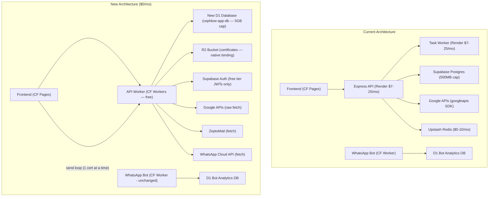

# Unified Master Plan: Express API & Supabase DB → Cloudflare Workers + D1

Replace the entire Render-hosted infrastructure with a **Cloudflare-native stack** running on the **Free Tier ($0/month)**. 

All application metadata, batches, wallet balances, and certificates will reside in a **new, dedicated Cloudflare D1 database** (`cephlow-app-db`), while **Supabase Auth** is retained purely for user identity management (sign-in/sign-up JWTs). Certificate delivery uses a **client-side send loop** to fit within the Worker 10ms CPU limit.

---

## 1. Resolved Decisions & Settings

1. **WhatsApp Worker:** Stays separate (`whatsapp-cert-bot` Worker remains untouched and uses its own `wa-bot-analytics` D1 database).
2. **Database:** A **brand new D1 database** (`cephlow-app-db`) will be created for the core application tables.
3. **Frontend:** Confirmed already hosted on Cloudflare Pages. No frontend migration work needed.
4. **Redis:** Dropped entirely. `REDIS_URL` will be removed.

---

## 2. Architecture Overview



### Key Cost & Resource Changes

| Component | Current Architecture | New Architecture |
|---|---|---|
| **API Server Hosting** | Render Node.js ($7–25/mo) | **Cloudflare Workers (Free — $0/mo)** |
| **Worker Queue Processors** | Render Node.js ($7–25/mo) | **Eliminated** (replaced by client-side send loops) |
| **Database** | Supabase Postgres (500MB limit) | **Cloudflare D1 (5GB limit — $0/mo)** |
| **Database Sleep Pause** | Sleeps after 1 week inactivity | **Never sleeps (Zero cold starts)** |
| **Queue Broker** | Upstash Redis ($0–10/mo) | **Eliminated** (no queue server needed) |
| **Identity Provider** | Supabase Auth (with DB storage) | **Supabase Auth (identity only, no DB storage)** |
| **Total Server Infrastructure** | **~$14–60/month** | **$0/month** |

---

## 3. Schema DDL: Supabase → D1 (SQLite)

D1 uses SQLite, which stores UUIDs/timestamps as `TEXT` and JSON columns as `TEXT` strings. Since the Worker is the gatekeeper, RLS is handled in application code instead of database policies.

```sql
-- schema.sql

-- 1. Workspaces
CREATE TABLE workspaces (
  id TEXT PRIMARY KEY,
  name TEXT NOT NULL,
  owner_id TEXT NOT NULL, -- Matches Supabase Auth UID
  current_balance REAL NOT NULL DEFAULT 0,
  created_at TEXT NOT NULL DEFAULT (datetime('now'))
);
CREATE INDEX workspaces_owner_id_idx ON workspaces(owner_id);

-- 2. Membership
CREATE TABLE workspace_members (
  workspace_id TEXT NOT NULL REFERENCES workspaces(id) ON DELETE CASCADE,
  user_id TEXT NOT NULL,
  role TEXT NOT NULL CHECK (role IN ('owner','admin','member')),
  joined_at TEXT NOT NULL DEFAULT (datetime('now')),
  PRIMARY KEY (workspace_id, user_id)
);
CREATE INDEX workspace_members_user_idx ON workspace_members(user_id);

-- 3. Batches
CREATE TABLE batches (
  id TEXT PRIMARY KEY,
  workspace_id TEXT NOT NULL REFERENCES workspaces(id) ON DELETE CASCADE,
  user_id TEXT NOT NULL,
  name TEXT NOT NULL,
  sheet_id TEXT DEFAULT '',
  sheet_name TEXT DEFAULT '',
  tab_name TEXT,
  spreadsheet_id TEXT,
  data_source_kind TEXT NOT NULL,
  template_id TEXT NOT NULL,
  template_name TEXT NOT NULL,
  template_kind TEXT NOT NULL,
  column_map TEXT,               -- Stored as JSON string
  email_column TEXT,
  name_column TEXT,
  email_subject TEXT,
  email_body TEXT,
  category_column TEXT,
  category_template_map TEXT,    -- Stored as JSON string
  category_slide_map TEXT,        -- Stored as JSON string
  category_slide_indexes TEXT,
  banner_url TEXT,
  frame_tier TEXT DEFAULT 'none',
  status TEXT NOT NULL DEFAULT 'draft',
  drive_folder_id TEXT,
  pdf_folder_id TEXT,
  total_count INTEGER DEFAULT 0,
  generated_count INTEGER DEFAULT 0,
  sent_count INTEGER DEFAULT 0,
  whatsapp_sent_count INTEGER DEFAULT 0,
  failed_count INTEGER DEFAULT 0,
  paid_frames TEXT DEFAULT '[]', -- Stored as JSON array string
  created_at TEXT NOT NULL DEFAULT (datetime('now'))
);
CREATE INDEX batches_workspace_idx ON batches(workspace_id);

-- 4. Certificates
CREATE TABLE certificates (
  id TEXT PRIMARY KEY,
  batch_id TEXT NOT NULL REFERENCES batches(id) ON DELETE CASCADE,
  recipient_name TEXT NOT NULL,
  recipient_email TEXT,
  status TEXT NOT NULL DEFAULT 'pending',
  row_data TEXT,                 -- Stored as JSON string
  slide_file_id TEXT,
  slide_url TEXT,
  pdf_file_id TEXT,
  pdf_url TEXT,
  r2_pdf_url TEXT,
  sent_at TEXT,
  error_message TEXT,
  is_paid INTEGER NOT NULL DEFAULT 0, -- 0/1 for booleans
  requires_visual_regen INTEGER NOT NULL DEFAULT 0,
  whatsapp_message_id TEXT,
  whatsapp_status TEXT,
  created_at TEXT NOT NULL DEFAULT (datetime('now')),
  updated_at TEXT NOT NULL DEFAULT (datetime('now'))
);
CREATE INDEX certs_batch_idx ON certificates(batch_id);

-- 5. User Profiles (caching creator status/credits)
CREATE TABLE user_profiles (
  id TEXT PRIMARY KEY,           -- Matches Supabase Auth UID
  email TEXT,
  is_approved INTEGER NOT NULL DEFAULT 0,
  creator_credits REAL NOT NULL DEFAULT 0,
  updated_at TEXT NOT NULL DEFAULT (datetime('now'))
);

-- 6. Ledgers
CREATE TABLE ledgers (
  id TEXT PRIMARY KEY,
  workspace_id TEXT NOT NULL REFERENCES workspaces(id) ON DELETE CASCADE,
  user_id TEXT NOT NULL,
  type TEXT NOT NULL CHECK (type IN ('topup','deduction','refund','transfer_in','transfer_out')),
  amount REAL NOT NULL,
  balance_after REAL NOT NULL,
  description TEXT NOT NULL,
  metadata TEXT,                 -- Stored as JSON string
  transfer_id TEXT,
  created_at TEXT NOT NULL DEFAULT (datetime('now'))
);
CREATE INDEX ledgers_workspace_idx ON ledgers(workspace_id);
```

---

## 4. Proposed Changes: Implementation Steps

### Phase 1: Create and Scaffolding D1 (~2 hours)

1. Create a brand new D1 database:
   ```bash
   npx wrangler d1 create cephlow-app-db
   ```
2. Initialize the schema locally and deploy to production:
   ```bash
   npx wrangler d1 execute cephlow-app-db --file=./schema.sql
   npx wrangler d1 execute cephlow-app-db --remote --file=./schema.sql
   ```

3. Create the API Worker workspace directory structure:
   * **[NEW] `workers/api/wrangler.toml`**
     Configure the R2 buckets, KV cache, and the newly created D1 bindings:
     ```toml
     name = "cephlow-api"
     main = "src/index.ts"
     compatibility_date = "2024-12-01"
     compatibility_flags = ["nodejs_compat"]

     [[r2_buckets]]
     binding = "CERTIFICATES"
     bucket_name = "certificates"

     [[kv_namespaces]]
     binding = "CACHE"
     id = "<created-via-wrangler>"

     [[d1_databases]]
     binding = "DB"
     database_name = "cephlow-app-db"
     database_id = "<your-d1-database-id>"

     [vars]
     R2_PUBLIC_URL = "https://pub-3e00f49622064202a04c19fb33ee2976.r2.dev"
     PUBLIC_BASE_URL = "https://cephlow.online"
     ```

4. **[NEW] `workers/api/src/index.ts`**
   Worker gateway implementing Hono:
   ```typescript
   import { Hono } from 'hono';
   import { cors } from 'hono/cors';

   const app = new Hono<{ Bindings: Env }>();
   app.use('*', cors({ origin: true, credentials: true }));

   // Public API routes
   app.route('/api', healthRouter);
   app.route('/api', verifyRouter);
   app.route('/api', galleryRouter);
   app.route('/api', profilesRouter);
   app.route('/api', webhooksRouter);
   
   // Auth verification middleware (Supabase JWT decode via Web Crypto API)
   app.use('/api/*', authMiddleware);
   app.route('/api', authRouter);
   app.route('/api', workspacesRouter);

   // Workspace context middleware
   app.use('/api/*', workspaceMiddleware);
   app.route('/api', batchesRouter);
   app.route('/api', certificatesRouter);

   export default app;
   ```

5. **[NEW] `workers/api/src/middleware/auth.ts`**
   Extracts `Bearer <token>` and verifies it using the Web Crypto API matching the `SUPABASE_JWT_SECRET`. Since Workers runs in a serverless environment, this avoids importing heavy external JWT libraries.

---

### Phase 2: Transaction Rewrites (PostgreSQL RPC → JS D1 Batch) (~6 hours)

Since D1 lacks PL/pgSQL RPC support, atomic operations are rewritten using the `db.batch()` API.

#### 1. Port `start_batch_generation` (Deduction transaction)
```typescript
// JS equivalent of start_batch_generation:
async function startBatchGeneration(db: D1Database, userId: string, batchId: string, cost: number, unpaidCertIds: string[], ledgerId: string, batchName: string, unpaidCount: number, regenCount: number, rate: number, regenRate: number) {
  // Read workspace & batch status
  const data = await db.prepare(`
    SELECT b.status as batch_status, w.current_balance, w.id as workspace_id
    FROM batches b
    JOIN workspaces w ON b.workspace_id = w.id
    WHERE b.id = ?
  `).bind(batchId).first();

  if (!data) throw new Error("Batch or Workspace not found");
  if (data.batch_status === 'generating') throw new Error('already_generating');
  if (data.batch_status === 'sending') throw new Error('currently_sending');
  if (data.current_balance < cost) throw new Error('insufficient_funds');

  const newBalance = data.current_balance - cost;
  
  // Assemble statements to execute atomically
  const stmts = [
    db.prepare(`UPDATE workspaces SET current_balance = ? WHERE id = ?`).bind(newBalance, data.workspace_id),
    db.prepare(`UPDATE batches SET status = 'generating' WHERE id = ?`).bind(batchId),
    db.prepare(`INSERT INTO ledgers (id, workspace_id, user_id, type, amount, balance_after, description, metadata) VALUES (?, ?, ?, 'deduction', ?, ?, ?, ?)`).bind(
      ledgerId, data.workspace_id, userId, -cost, newBalance, `Certificate generation: ${batchName}`,
      JSON.stringify({ batch_id: batchId, unpaid_count: unpaidCount, regen_count: regenCount, rate, regen_rate: regenRate })
    )
  ];

  if (unpaidCertIds.length > 0) {
    stmts.push(db.prepare(`
      UPDATE certificates 
      SET is_paid = 1 
      WHERE id IN (${unpaidCertIds.map(() => '?').join(',')})
    `).bind(...unpaidCertIds));
  }

  await db.batch(stmts);
}
```

---

### Phase 3: Library Rewrites (Google REST & R2 Native Bindings) (~8 hours)

#### 1. Replace `googleapis` with pure HTTP `fetch`
Rewrite all functions inside `googleDrive.ts` and `googleSheets.ts` to perform direct HTTP calls.

```typescript
// Example: Creating a directory in Google Drive via fetch:
export async function createFolder(accessToken: string, folderName: string, parentId?: string): Promise<string> {
  const metadata = {
    name: folderName,
    mimeType: 'application/vnd.google-apps.folder',
    parents: parentId ? [parentId] : undefined,
  };

  const response = await fetch('https://www.googleapis.com/drive/v3/files', {
    method: 'POST',
    headers: {
      Authorization: `Bearer ${accessToken}`,
      'Content-Type': 'application/json',
    },
    body: JSON.stringify(metadata),
  });

  const data = await response.json();
  if (!response.ok) throw new Error(data.error?.message || "Failed to create folder");
  return data.id;
}
```

#### 2. R2 Binding Integration
Replace the AWS S3 SDK completely with native D1/R2 bindings for direct file uploads/deletions.

```typescript
// Before (S3 SDK):
const client = new S3Client({ ... });
await client.send(new PutObjectCommand({ Bucket, Key, Body, ContentType }));

// After (R2 Binding):
await env.CERTIFICATES.put(key, buffer, {
  httpMetadata: { contentType: 'application/pdf' }
});
```

---

### Phase 4: Route Migration (Express → Hono) (~8 hours)

Convert all 23 REST controllers to Hono. Query logic will use standard SQL statements via D1 bindings instead of Supabase's JavaScript builder client.

```typescript
// Example endpoint: Get all batches
app.get('/api/batches', async (c) => {
  const workspaceId = c.get('workspaceId');
  const user = c.get('user');

  const { results } = await c.env.DB.prepare(`
    SELECT * FROM batches 
    WHERE workspace_id = ? 
    ORDER BY created_at DESC
  `).bind(workspaceId).all();

  // Convert JSON fields back to objects
  const batches = results.map(row => ({
    ...row,
    columnMap: JSON.parse(row.column_map || '{}'),
    paidFrames: JSON.parse(row.paid_frames || '[]'),
  }));

  return c.json({ batches });
});
```

---

### Phase 5: Client-Side Send Loop (~4 hours)

Since background worker queues are disabled on the free tier, the batch sending process (email & WhatsApp) is offloaded to the client browser.

#### 1. Frontend hook for client-side loop
**`apps/cert-app/src/hooks/use-client-send.ts`**
```typescript
import { useState } from 'react';

export function useClientSend() {
  const [progress, setProgress] = useState({ sent: 0, failed: 0, total: 0 });
  const [isSending, setIsSending] = useState(false);

  async function sendBatch(batchId: string, certIds: string[], mode: 'email' | 'whatsapp', templateOpts) {
    setIsSending(true);
    setProgress({ sent: 0, failed: 0, total: certIds.length });

    // Mark batch as sending
    await api.post(`/batches/${batchId}/send-start`);

    const CONCURRENCY_LIMIT = 3;
    for (let i = 0; i < certIds.length; i += CONCURRENCY_LIMIT) {
      const chunk = certIds.slice(i, i + CONCURRENCY_LIMIT);
      
      await Promise.allSettled(
        chunk.map(async (certId) => {
          try {
            await api.post(`/batches/${batchId}/certificates/${certId}/send-${mode}`, templateOpts);
            setProgress(p => ({ ...p, sent: p.sent + 1 }));
          } catch (e) {
            setProgress(p => ({ ...p, failed: p.failed + 1 }));
          }
        })
      );
    }

    // Finalize status on completion
    await api.post(`/batches/${batchId}/send-complete`, {
      sent: progress.sent,
      failed: progress.failed
    });
    setIsSending(false);
  }

  return { sendBatch, progress, isSending };
}
```

#### 2. Backend endpoints supporting the loop
The server-side endpoint processes one request at a time, completely executing the send logic (fetch PDF, Base64 encode, call ZeptoMail/WhatsApp API) within **1–3ms CPU limit**:
* `POST /api/batches/:batchId/certificates/:certId/send-email`
* `POST /api/batches/:batchId/certificates/:certId/send-whatsapp`

---

### Phase 6: Supabase → D1 Data Migration Script (~3 hours)

A script runs once to extract existing Supabase tables and backfill D1 production tables before the switch.

**`scripts/d1-sync.js`**
```javascript
const { createClient } = require('@supabase/supabase-js');
const { execSync } = require('child_process');

const supabase = createClient(process.env.SUPABASE_URL, process.env.SUPABASE_SERVICE_ROLE_KEY);

async function exportTable(tableName) {
  console.log(`Fetching data from Supabase: ${tableName}...`);
  const { data, error } = await supabase.from(tableName).select('*');
  if (error) throw error;

  console.log(`Writing inserts to D1 for ${tableName} (${data.length} rows)...`);
  for (const row of data) {
    // Generate sqlite insert values, stringifying JSON objects
    const cols = Object.keys(row).join(', ');
    const placeholders = Object.keys(row).map(() => '?').join(', ');
    const values = Object.values(row).map(val => 
      typeof val === 'object' && val !== null ? JSON.stringify(val) : val
    );

    // Call wrangler D1 locally or directly remote via CLI
    execSync(`npx wrangler d1 execute cephlow-app-db --remote --command="INSERT INTO ${tableName} (${cols}) VALUES (${placeholders})" --args='${JSON.stringify(values)}'`);
  }
}
```

---

## 5. Verification Plan

1. **Local Worker Testing:**
   Use wrangler local execution to point endpoints to a local D1 instance:
   ```bash
   npx wrangler dev --local
   ```
2. **Schema Integration Check:**
   Verify transactions run correctly under batch queries (insufficient wallet credits, double generation requests, frame purchase locks).
3. **Loop Robustness:**
   Simulate tab close during generation or sending to verify the backend updates batch status to `partial` cleanly without leaving the batch locked.
